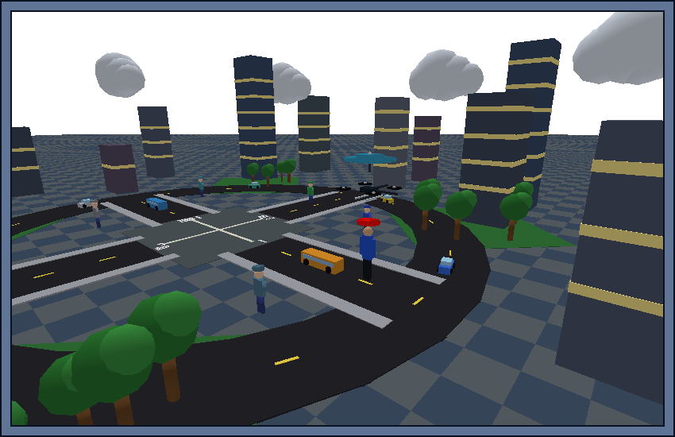
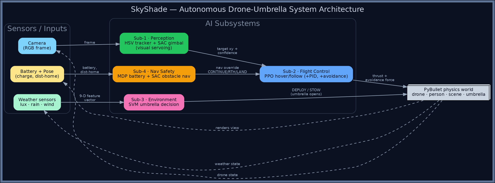

# SkyShade Wiki

SkyShade is a drone that follows you around and holds an umbrella over your head — opening it when it rains and stowing it when the sky clears. The whole thing runs in simulation, and four small AI subsystems do the work: one finds you, one flies the drone, one reads the weather, and one keeps the battery (and your buildings) safe.

**Course:** AI for Robotics — UTS, May 2026  
**Team:** Gohan Idrisoglu (Lead) · Dinesh Saravanan · Aaron · Saaranj

<p align="center">
  
</p>

<p align="center"><sub><em><b>Figure 1.</b> SkyShade in the Building District — the drone hovers over the pedestrian (red cap marker) with its umbrella open, while steering around the buildings.</em></sub></p>

<p align="center">
  
</p>

<p align="center"><sub><em><b>Figure 2.</b> How it fits together: three sensor inputs feed four AI subsystems, which drive the drone in a PyBullet world. Full walkthrough on the <a href="Architecture">Architecture</a> page.</em></sub></p>

---

## Pages

| Page | Description |
|---|---|
| [Project Overview](Project-Overview) | Goals, scope, and system summary |
| [Architecture](Architecture) | How the four subsystems connect, file layout, control flow |
| [Using the GUI](Using-the-GUI) | **Step-by-step guide to the Launcher, Training Grounds hub, and Simulation dashboard** |
| [Training Grounds](Training-Grounds) | **Full guide to every tab, chart, button, and visual overlay in the hub** |
| [Training the Models](Training-the-Models) | How to train each subsystem, expected times, verify results |
| [Running the Simulation](Running-the-Simulation) | Prerequisites, launch options, scenarios, post-run efficiency report |
| [Sub-1: Perception](Sub-1-Perception) | HSV tracking, visual servo, distance estimation, EMA, calibration room |
| [Sub-2: Flight Control](Sub-2-Flight-Control) | PPO hover agent (4 parallel envs), multi-run training chart |
| [Sub-3: Environmental Decision](Sub-3-Environmental-Decision) | SVM umbrella classifier, weather visualisation |
| [Sub-4: Navigation and Safety](Sub-4-Navigation-Safety) | MDP battery-safety + SAC obstacle navigation |
| [Validation and Results](Validation-and-Results) | Metrics, run-history graphs, performance trend chart |
| [Known Issues and Decisions](Known-Issues-and-Decisions) | Design decisions, bugs fixed, future work |

---

## Quick start

```bash
# Install dependencies
python3 -m venv venv && source venv/bin/activate
pip install -r requirements.txt

# Open the launcher — train each subsystem first, then launch
python3 run_sim.py
```

## Before first launch — train the models

### Fastest: one-click Auto-Train (~3 min)

Click **🚀 Auto-Train All** on the launcher. The Training Grounds hub opens and trains all subsystems automatically — no button pressing needed:

```
Step 1/4  Sub-2 Flight PPO   ~60 sec
Step 2/4  Sub-3 Weather SVM   ~3 sec
Step 3/4  Sub-4 Battery MDP   ~1 sec
Step 4/4  Sub-4 Nav SAC       ~50 sec   (trains on the selected scenario's layout)
Total ≈ 2 min 15 sec
```

When complete, the banner turns green: `✅ Training complete! → Select scenario and Launch.`

> **Scenario-aware nav** — whichever scenario is selected in the launcher (Park / Building District / …) is passed through to Auto-Train, so **Sub-4 Nav SAC** learns to dodge a layout that matches that world.
> **Note:** Auto-Train covers Sub-2, Sub-3 and Sub-4. Sub-1 Perception is a deterministic HSV tracker with an optional gimbal-SAC trainer, and is not part of the Auto-Train sequence.

### Or train individually

| Step | Card | Button | Time (first) | Time (repeat) |
|---|---|---|---|---|
| 1 | Sub-1 Perception | **Calibrate** | Instant | Instant |
| 2 | Sub-2 Flight | **Train PPO** | ~2 min (4 parallel envs) | ~1 min |
| 3 | Sub-3 Weather | **Train SVM** | < 2 sec | < 2 sec |
| 4 | Sub-4 Safety | **Solve MDP** | < 1 sec | < 1 sec |
| 5 | Sub-4 Safety | **Train Navigation** | ~1 min (SAC) | ~30 sec |

See [Training Grounds](Training-Grounds) for a full guide, and [Using the GUI](Using-the-GUI) for step-by-step instructions.

---

## What's new

### Simulation Complete dialog
After every run, a dialog replaces the automatic shutdown:

- **Per-subsystem retrain checkboxes** — auto-ticked for any subsystem scoring poorly. Select exactly which models to retrain.
- **Retrain Selected & Run** — opens the full Training Grounds hub for only the selected stages, then relaunches automatically when done.
- **Run Again** — reruns the same scenario immediately without retraining.
- **Scenario picker** — switch between Park / Forest Trail / Building District / Urban Trail for the next run without going back to the launcher.
- **Performance trend chart** — bar chart of overall% across all historical runs so you can see improvement over time.

### Four scenarios

| Scenario | Key challenge |
|---|---|
| **Park** | Figure-8 path, light obstacles, best for first runs |
| **Forest Trail** | Dense canopy occludes the downward camera; tree avoidance |
| **Building District** | City plaza with buildings, roads, vehicles, pedestrians |
| **Urban Trail** | Bridge/underpass the drone must fly over; 8 crowd pedestrians as tracker distractors |

### Urban Trail — bridge fly-over
The drone detects when it is within ±4.5 m of the bridge centre and automatically climbs from 2.5 m to 5.5 m to clear the deck, then descends once past. The terminal prints `[Bridge] fly-over ACTIVE` and `CLEAR` events.

### Visual servo (Sub-1)
The tracker now closes a pixel-space feedback loop each frame: it measures the marker's pixel offset from image centre and nudges the gimbal target by the equivalent world-space displacement. The marker stays pinned near the centre of the drone camera even during fast user movement.

### Persistent run history & live graph overlays
Every completed run saves a 1-Hz downsampled time-series and summary stats to `reports/run_metrics_history.json`. The Drone POV & AI Evidence window overlays the last 5 runs as faded dashed ghost lines on each subsystem graph, so you can see improvement between runs in real time.

### Training reward history
Completed PPO and SAC training sessions are saved to `reports/training_history.json`. The Training Grounds hub loads them on startup so the multi-run reward chart persists across restarts.

### Colour terminal output
The terminal now prints ANSI-coloured event notifications as state changes happen — no waiting for the 5-second log row:

```
  [Weather]        Cloudy → Full rain  rain 0.87  wind 5.5 m/s
  [Sub-3 Umbrella] STOW → DEPLOY       rain 0.94  lux 7637  wind 5.0
  [Sub-4 Nav]      CONTINUE → RTH      battery 49.5%  dist-home 4.1 m
  [Sub-4 Battery]  Watch battery: 49.9%
  [Bridge]         fly-over ACTIVE      drone-x -2.3  alt → 5.5 m
  [Sub-1 Tracker]  Lock LOST  conf 0.42 — gimbal searching
```

---

## After running the simulation

The terminal prints a full **Efficiency Report** with a grade. The Simulation Complete dialog shows it visually with colour-coded verdict chips:

```
════════════════════════════════════════════════════════════
  SkyShade — Post-Run Efficiency Report
════════════════════════════════════════════════════════════
  Sub-2  Hover accuracy   :  73.4%  ✓ good
         Mean hover error  :  0.38 m  ✓ within 0.5m
  Sub-1  Tracker lock     :  98.2%  ✓ reliable
  Sub-3  Umbrella correct :  91.7%  ✓ accurate
  Sub-4  Battery at end   :  42.0%  ✓ safe
════════════════════════════════════════════════════════════
  Overall system score: 87%  Grade: A
════════════════════════════════════════════════════════════
```

See [Validation and Results](Validation-and-Results) for what each metric means.
