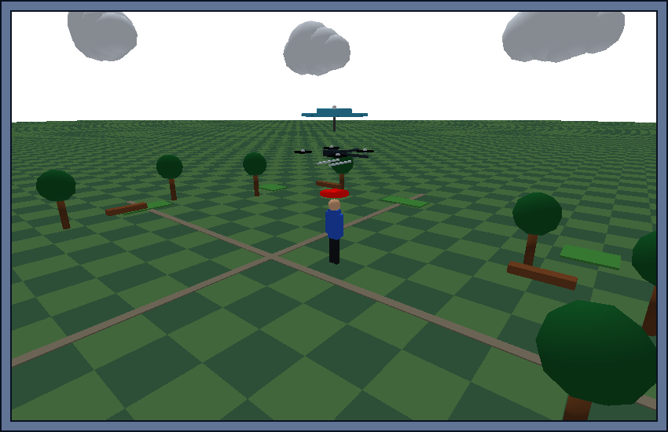
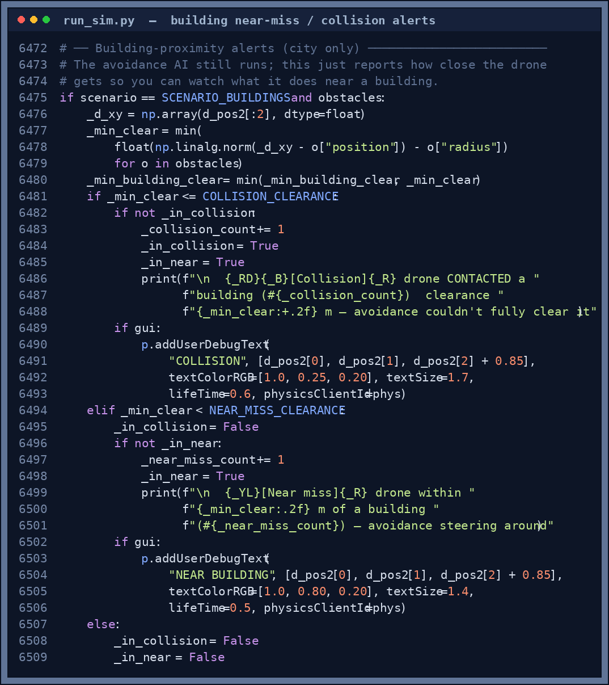
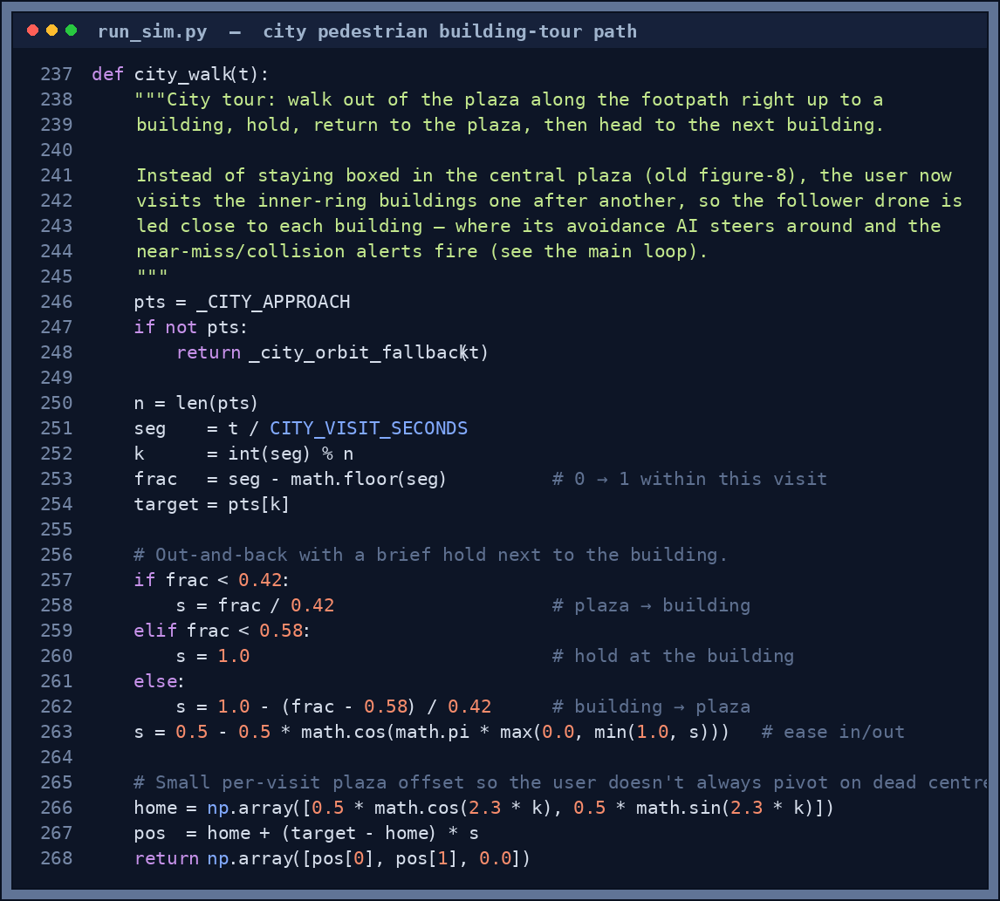

# Running the Simulation

## Prerequisites

| Dependency | Version |
|---|---|
| Python | 3.10+ |
| PyBullet | latest |
| PyTorch | 2.x (CPU build) |
| Stable-Baselines3 | 2.x |
| Gymnasium | 1.x |
| OpenCV | 4.x |

Install Python dependencies:

```bash
python3 -m venv venv
source venv/bin/activate
pip install -r requirements.txt
```

---

## Step 1 — Train the models (required before first launch)

```bash
python3 run_sim.py
```

The launcher opens. Click **🚀 Auto-Train All** to train everything in one step (~3 min), or use the individual subsystem cards. See [Training Grounds](Training-Grounds) for details.

---

## Step 2 — Launch a scenario

After training, select a scenario in the launcher and click **Launch**. A subprocess starts with the PyBullet window, the Drone POV dashboard, and the Telemetry Dashboard.

```bash
# Direct launch (bypasses launcher)
python3 run_sim.py --scenario park       # Park (default)
python3 run_sim.py --scenario forest     # Forest Trail
python3 run_sim.py --scenario buildings  # Building District
python3 run_sim.py --scenario trail      # Urban Trail (bridge + crowd)

# Options
python3 run_sim.py --duration 60         # run for 60 s (default 120)
python3 run_sim.py --flight pid          # force PID (ignore PPO)
python3 run_sim.py --demo-low-battery    # trigger RTH quickly for testing
python3 run_sim.py --no-gui              # headless, no PyBullet window
```

---

## Scenarios

### Park (default)
Open park with benches, small trees, and a figure-8 walking path. Best for first runs and PPO training validation. The drone follows the user on a smooth closed loop.

<p align="center">
  
</p>

<p align="center"><sub><em>The Park scenario — open lawn, scattered trees and benches, with the drone trailing the user. The calmest scene, and the one where hover accuracy is highest.</em></sub></p>

### Forest Trail
Dense tree canopy with a 18 m dirt trail. The user walks at 0.42 m/s; the drone must avoid trunks while keeping the red cap marker in view through gaps in the canopy. The trail resets (drone teleports) when the user completes a lap.

**Key challenge:** tracker lock drops when the canopy closes overhead. The red marker disk (30 cm radius) is deliberately large to compensate.

### Building District
An enlarged city: a clear central plaza ringed by tall buildings (11–17 m out), a ring road with parked cars and buses, grassy corners with trees, and pedestrians in non-red clothing.

Instead of staying boxed in the plaza, the user now **walks a footpath tour** — out of the centre, right up to one building, holds, then back and on to the next building. The drone follows, so it actually approaches buildings, where two things happen:

| Behaviour | Detail |
|---|---|
| **Avoidance steers it around** | The repulsive `obstacle_avoidance_force` pushes the drone off the building wall — it keeps tracking the user but bends its path around the obstacle. |
| **Near-miss / collision alerts** | When clearance gets tight the loop logs a yellow `[Near miss]` (and a red `[Collision]` if it ever actually touches); a floating `NEAR BUILDING` / `COLLISION` label appears over the drone in the 3D view, and the counts go into the post-run report. |

<p align="center">
  
</p>

<p align="center"><sub><em><b>Figure 1.</b> The proximity logic in <code>run_sim.py</code> (Building District only). Each tick it computes the drone's clearance to the nearest building; below <code>NEAR_MISS_CLEARANCE</code> it warns, and only if the drone is actually inside the wall (avoidance failed) does it count a collision. The debounce flags mean one alert per approach, not per frame.</em></sub></p>

The tour itself is just a short parametric path — walk out to a recorded building approach point, hold, walk back, advance to the next one:

<p align="center">
  
</p>

<p align="center"><sub><em><b>Figure 2.</b> <code>city_walk()</code> in <code>run_sim.py</code> — an out-and-back ease between the plaza and each inner-ring building, which is what leads the follower drone up to the buildings in the first place.</em></sub></p>

This makes the city a good place to *watch how the drone handles buildings* — it should weave around them, with the report reading "flew close, avoided".

### Urban Trail *(new)*
A 26 m paved trail (loops) with:

| Feature | Detail |
|---|---|
| **Bridge / underpass** | Centred at x=0, 5.6 m wide interior, 3.0 m deck height. The drone's normal hover altitude is 2.5 m — it would collide with the deck. |
| **Fly-over logic** | When the drone or user enters the ±4.5 m bridge zone, the target altitude jumps to 5.5 m. The drone climbs over, clears the bridge, and descends back to 2.5 m. |
| **8 crowd pedestrians** | Non-red shirts (blue, green, grey, teal, purple, seafoam, brown). Added to the collision obstacle list so the drone steers around them. Sub-1 tracker ignores them because they have no red marker. |
| **Terminal events** | `[Bridge] fly-over ACTIVE` / `CLEAR` printed when the zone is entered/exited. |

---

## What to expect during a run

- The drone hovers at **2.5 m** above the user, following via the PPO+PID controller
- Battery drains at **0.5% / sec**; Sub-4 MDP triggers **RTH** when battery falls to the threshold
- The umbrella disc turns green on `DEPLOY`, grey on `STOW`
- Weather cycles automatically every 8–20 s between Cloudy / Light rain / Full rain

### Drone POV & AI Evidence window

Displays:
- **Camera feed** (1280 × 720 upscaled) with HSV detection overlay: green bounding box on the red marker, white crosshair
- **Weather rain/wind overlay** on the camera image — number of streaks scales with intensity, angle follows wind direction
- **5 live graphs** in a 3-col × 2-row grid: Sub-1 confidence, Sub-2 hover error, Sub-2 avoidance force, Sub-4 battery, Sub-3 umbrella decision
- **Ghost lines** (dashed, faded) of the last 5 runs overlaid on each graph — compare current vs. history at a glance
- **Performance trend bar chart** at the bottom showing overall% per historical run with a smoothed trend line

### Terminal output

The terminal prints colour-coded events as they happen (not just on the 5-second interval):

| Event tag | Fires when |
|---|---|
| `[Weather]` | Weather mode switches (e.g. Cloudy → Full rain) |
| `[Sub-3 Umbrella]` | Umbrella toggles DEPLOY ↔ STOW |
| `[Sub-4 Nav]` | Nav override changes CONTINUE → RTH → LAND_NOW |
| `[Sub-4 Battery]` | Battery crosses 50%, 30%, or 10% threshold |
| `[Bridge]` | Drone enters or exits the Urban Trail bridge zone |
| `[Sub-1 Tracker]` | Tracker confidence crosses the lock/lost threshold |

Every 5 seconds a coloured table row is also printed:

```
  Time   Battery     Nav       Flight    Umbrella   Conf     Err    Alt   Progress
     0.0s  100.0%  CONTINUE    PPO+PID    stow      1.00   0.00m  2.50m  [░░░░░░░░░░░░]    0%
    32.1s   83.9%  CONTINUE    PPO+PID    DEPLOY    1.00   0.87m  2.50m  [███░░░░░░░░░]   27%
```

Colours: **green** = healthy/good, **amber** = watch, **red** = critical.

---

## After the simulation — Simulation Complete dialog

When the scenario finishes (or when you close the dashboard), a **Simulation Complete** dialog pops up instead of the process just vanishing. It shows the graded report, lets you tick which subsystems to retrain, and offers to relaunch — all without going back to the launcher.

A typical report looks like this:

| Subsystem | Metric | Verdict |
|---|---|---|
| Sub-1 Perception | Tracker lock **93%** | ✅ reliable |
| Sub-2 Flight | Hover accuracy **37%** · error 0.59 m | ❌ train more *(auto-ticked)* |
| Sub-3 Weather | Umbrella correct **91%** | ✅ accurate |
| Sub-4 Nav/Safety | Battery **40%** at end | ✅ safe |
| **Overall** | **74% · Grade B** | → *Sub-2 PPO needs more hover training* |

Underneath sits a **performance-trend bar chart** (overall % across your last runs, coloured by grade), a **scenario picker** (Park / Forest Trail / Buildings / Urban Trail), and three buttons:

### Buttons

| Button | What happens |
|---|---|
| **Retrain Selected & Run** | Opens the Training Grounds hub for only the ticked subsystems. When training completes the hub closes and the scenario relaunches automatically. |
| **Run Again** | Reruns the selected scenario immediately (no retraining). |
| **Close** | Exits the process. |

### Scenario picker

Click **Park**, **Forest Trail**, **Building District**, or **Urban Trail** to switch the scenario for the next run — no need to go back to the launcher.

### Retrain checkboxes

Checkboxes are auto-ticked for underperforming subsystems:
- Sub-2 PPO auto-ticked when hover accuracy < 50%
- Sub-3 SVM auto-ticked when umbrella accuracy < 75%
- Sub-4 MDP + Nav auto-ticked when battery ends critical (< 10%)

You can tick/untick any combination manually.

---

## Saved files

| File | Updated when |
|---|---|
| `models/ppo_flight_v1.zip` | After every Sub-2 PPO training session |
| `models/svm_v1.pkl` | After every Sub-3 SVM training session |
| `models/policy_table_v1.npy` | After every Sub-4 MDP solve |
| `models/ppo_nav_v1.zip` | After every Sub-4 Nav SAC training session |
| `reports/run_summary_latest.json` | After every simulation run |
| `reports/run_metrics_history.json` | Appended after every simulation run (last 20 kept) |
| `reports/training_history.json` | Updated after every PPO / SAC training session |

---

## Troubleshooting

**PyBullet window does not open**
```bash
Xvfb :1 -screen 0 1024x768x24 &
export DISPLAY=:1
python3 run_sim.py
```

**Hover accuracy stays near 3% in forest**  
The look-ahead is automatically disabled for the Forest and Urban Trail scenarios because the winding path causes oscillation. If accuracy is still low, run more training from the Simulation Complete dialog.

**"Models not trained" dialog on launch**  
Click **🚀 Auto-Train All** in the launcher. This trains all four subsystems in ~3 min.

**`stable_baselines3` or `gymnasium` not found**
```bash
pip install stable-baselines3 gymnasium torch --index-url https://download.pytorch.org/whl/cpu
```
