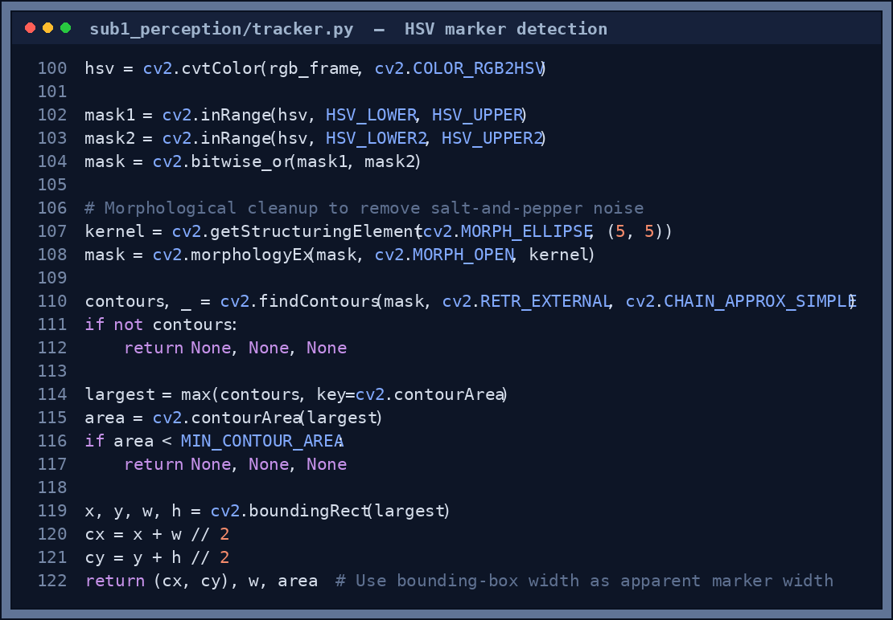
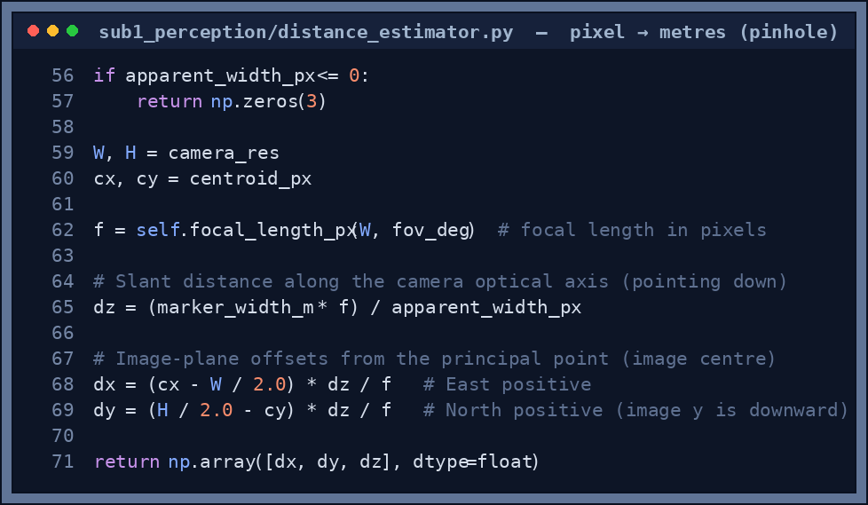
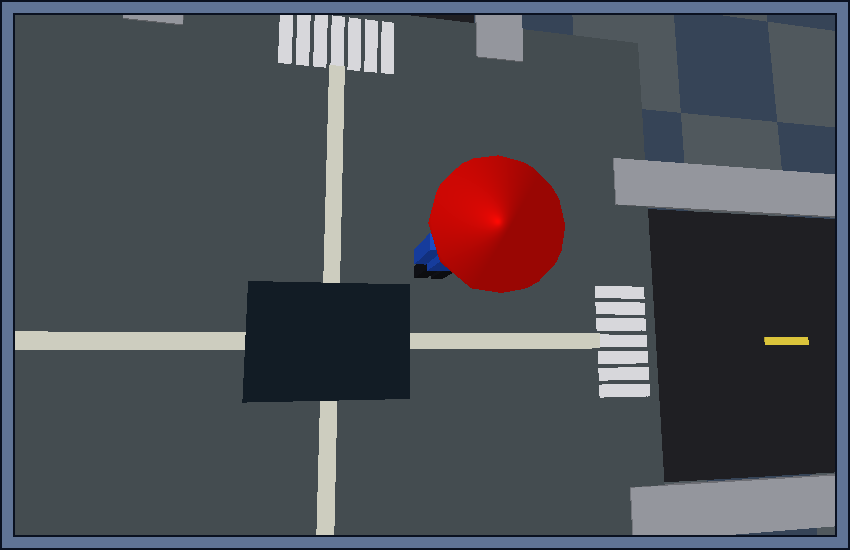

# Sub-1: Perception

## Responsibility

Identify the user in the simulated downward-facing camera feed and publish their position relative to the drone, along with a tracking confidence score.

---

## How it works

1. PyBullet renders an RGB frame from a virtual camera mounted below the drone
2. OpenCV HSV segmentation isolates the user's red marker cap
3. The largest detected contour's centroid gives the pixel-space offset `(cx, cy)`
4. A pinhole focal-length model converts pixel offset to metres using the known marker width
5. An Exponential Moving Average smooths the (Δx, Δy, Δz) output to suppress per-frame jitter
6. **Visual servo** — the pixel error `(cx − W/2, cy − H/2)` is projected into world-space using the camera's right/down axes and applied as a 35% proportional correction to the gimbal target each frame, actively centering the marker in the image
7. If confidence falls below threshold, the last known position is held for up to 20 frames (occlusion holdout), and the gimbal sweeps a search circle at `GIMBAL_SEARCH_RADIUS`
8. Position and confidence are published to `/skyshade/user_position` and `/skyshade/tracking_confidence`

<p align="center">
  
</p>

<p align="center"><sub><em><b>Figure 1.</b> The core of the tracker (<code>tracker.py</code>). The RGB frame is converted to HSV, two red bands are thresholded and OR-ed (red wraps around the 0°/180° hue boundary), a morphological open removes speckle, and the <b>largest contour above <code>MIN_CONTOUR_AREA</code></b> gives the marker centroid <code>(cx, cy)</code> and apparent width used for distance.</em></sub></p>

---

## Key parameters

| Parameter | Value | Description |
|---|---|---|
| `EMA_ALPHA` | 0.3 | Smoothing factor — higher = less smoothing |
| `CONFIDENCE_THRESH` | 0.7 | Minimum confidence to publish a position |
| `MAX_OCCLUSION_FRAMES` | 20 | Frames to hold last known position when marker is lost |
| `MARKER_WIDTH_M` | 0.1 | Known physical width of the user's marker (metres) |
| `CAMERA_FOV` | 60° | Virtual camera field of view |
| `CAMERA_RES` | 640 × 480 | Raw camera resolution (displayed upscaled to 1280 × 720) |
| `CAMERA_FPS` | 30 | Frames per second |
| `GIMBAL_LOOKAHEAD_SECONDS` | 0.95 s | How far ahead to lead the gimbal target |
| `GIMBAL_SEARCH_RADIUS` | 0.55 m | Sweep radius when marker is lost |
| Visual servo gain | 0.35 | Fraction of pixel error corrected per frame |

---

## From pixels to metres

Once the tracker has the marker's pixel position and width, a pinhole camera model turns that into a real `(dx, dy, dz)` offset in the drone's body frame — the apparent width shrinks with distance, so it doubles as a cheap range-finder:

<p align="center">
  
</p>

<p align="center"><sub><em><b>Figure 2.</b> <code>distance_estimator.py</code>: <code>dz</code> comes from the known marker width vs. its apparent pixel width, then the image-plane offset is back-projected to give <code>dx</code> (east) and <code>dy</code> (north).</em></sub></p>

---

## Visual servo

The visual servo is a **closed-loop pixel-space controller** that runs every frame alongside the predictive gimbal:

```
Detect marker at (cx, cy) in image
err_x = cx - W/2        # pixels right of image centre
err_y = cy - H/2        # pixels below image centre

# Convert to world-space using camera geometry
frac_x = err_x / W
frac_y = err_y / H
view_dist = distance from drone to gimbal_target

delta_world_x = 2 * frac_x * view_dist * tan(FOV_h / 2)
delta_world_y = 2 * frac_y * view_dist * tan(FOV_v / 2)

# Project along camera axes (correct for any gimbal angle)
correction = delta_world_x * cam_right + delta_world_y * cam_down

gimbal_target += correction * 0.35   # gentle proportional step
```

The predictive gimbal and visual servo work in parallel:
- **Predictive tracker** — points camera to where user *will be* based on velocity (good for fast motion)
- **Visual servo** — corrects residual pixel error once the marker is visible (good for steady centering)

Result: the red marker stays near the centre of the drone camera image even during fast walking or turns.

---

## Marker design — Urban Trail scenario

In dense environments (forest canopy, crowd scenes), a small marker is frequently occluded. The red marker disk in the user model has been increased to **30 cm radius** (vs. 10 cm in earlier versions). This is consistent with real-world outdoor drone marker practice where 20–40 cm fiducials are standard.

---

## Training Grounds — calibration room

Sub-1 uses a deterministic HSV tracker — no neural network model is trained. The Training Grounds hub provides a live calibration check.

<p align="center">
  
</p>

<p align="center"><sub><em><b>Figure 3.</b> What the tracker works with — the drone's downward camera image. The bright red cap marker is unmistakable against the street, which is exactly why a simple HSV threshold locks onto it so reliably.</em></sub></p>

### What the calibration room shows

- A 3D room with a red sphere moving on a figure-8 path
- The virtual camera is mounted below the drone looking down
- The tracker runs in real-time on the rendered frame
- **White circle** = where the marker is expected to be
- **Green bounding box** = what the HSV algorithm detected
- **Confidence bar** = detection quality score

### Passing condition

The calibration passes when detected centroid is within `TRAINING_PIXEL_PASS = 18 px` of the true marker centre.

```
LOCKED: confidence 0.94, error 8.3px
Estimated body offset: dx +0.12 m, dy -0.08 m, dz 2.50 m
```

If detection fails, check HSV bounds in `sub1_perception/tracker.py`:
```python
HSV_LOWER  = np.array([0,   120, 70], dtype=np.uint8)
HSV_UPPER  = np.array([10,  255, 255], dtype=np.uint8)
HSV_LOWER2 = np.array([170, 120, 70], dtype=np.uint8)
HSV_UPPER2 = np.array([180, 255, 255], dtype=np.uint8)
```

These cover the full red hue range (0–10° and 170–180°). If the marker colour is changed in `create_person()`, update these bounds to match.

---

## Rain overlay on camera feed

During rain, the drone POV window shows weather effects directly on the camera image:

| Rain intensity | Drops drawn | Style |
|---|---|---|
| Light (0.05–0.3) | 12–26 | Thin diagonal streaks angled by wind direction |
| Moderate (0.3–0.7) | 26–48 | Longer streaks, wider lines |
| Heavy (> 0.7) | 48–60 | Dense curtain, bright blue-white |

Wind streaks (horizontal wisps) appear when wind ≥ 2 m/s. This overlay is drawn in OpenCV on the numpy frame before display — no GPU cost, no PyBullet API calls.

---

## How confidence is computed

```python
FULL_CONF_AREA = MIN_CONTOUR_AREA * 10   # = 500 px²
confidence = clip(blob_area / FULL_CONF_AREA, 0.0, 1.0)
```

A blob clearly larger than 500 px² gets confidence 1.0. Confidence degrades when the marker is far away or partially occluded, and drops to 0 after `MAX_OCCLUSION_FRAMES = 20` consecutive missed frames.

---

## Live event terminal output

```
[Sub-1 Tracker] Lock LOST  conf 0.42 — gimbal searching
[Sub-1 Tracker] Lock RECOVERED  conf 1.00
```

These fire immediately on threshold crossing, not on the 5-second logging interval.

---

## Files

| File | Purpose |
|---|---|
| `sub1_perception/tracker.py` | HSV detection, EMA smoothing, confidence, `pixel_centroid` attribute |
| `sub1_perception/distance_estimator.py` | Pinhole model: pixel offset → metres |
| `sub1_perception/training.py` | Calibration room logic (used by Training Grounds hub) |
| `sub1_perception/training_env.py` | PyBullet calibration room environment |
| `sub1_perception/test_perception.py` | Unit test: tracker accuracy on synthetic frames |

---

## Tests

Run the perception validation test:

```bash
python sub1_perception/test_perception.py
```

It renders synthetic frames with a red marker at known offsets and checks two things:

| Check | Target | Latest result |
|---|---|---|
| Tracking continuity (frames above `CONFIDENCE_THRESH`) | > 70 % | **100 %** ✓ |
| Position MAE vs. ground truth | < 0.15 m | **0.081 m** ✓ |

```text
Tracking continuity : 100.00%  (target > 70%)
Position MAE        : 0.0810 m  (target < 0.15 m)
Sub-1 PASSED all checks.
```
