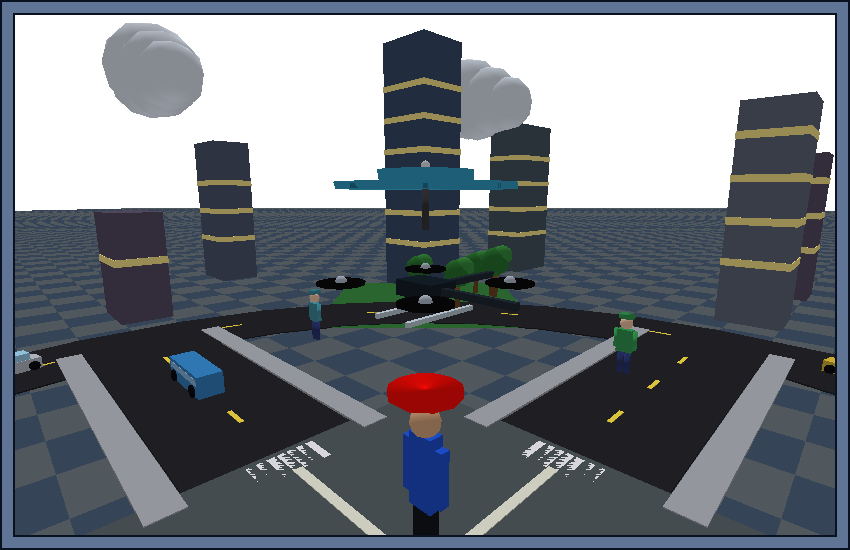
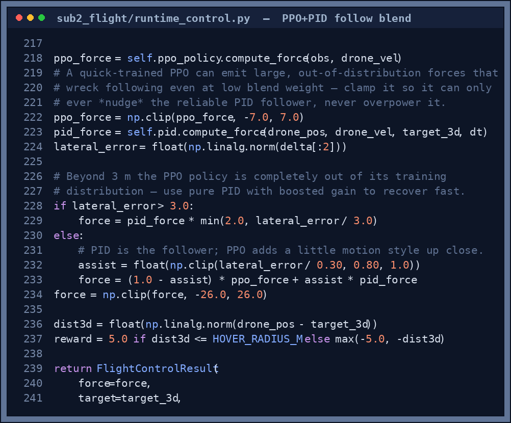
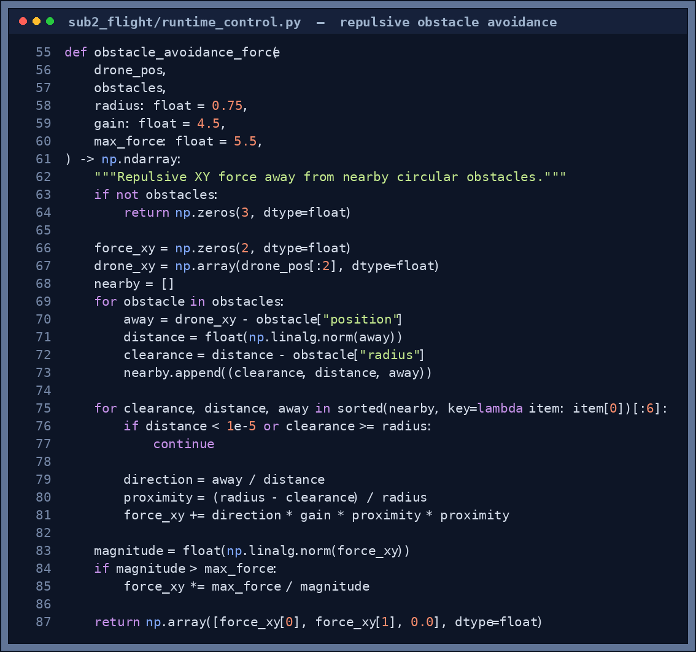
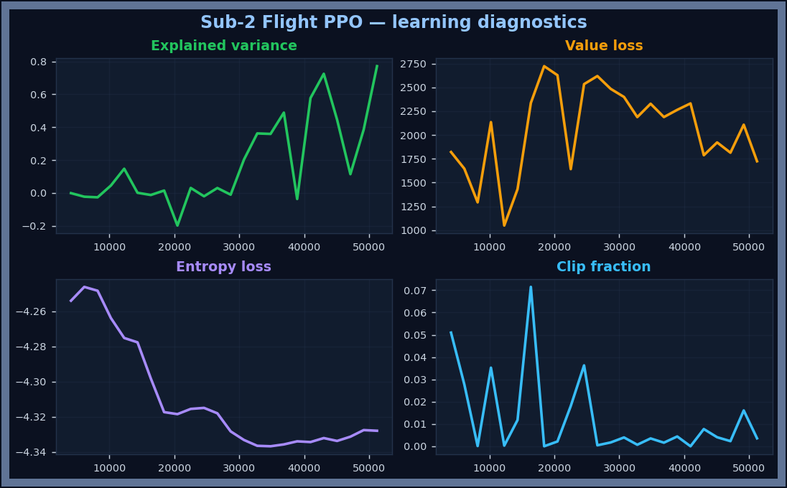

# Sub-2: Flight Control

## Responsibility

Keep the drone hovering directly above the user at `TARGET_ALTITUDE` (2.5 m), following them as they walk. Yield control to Sub-4 when a safety override is active.

<p align="center">
  
</p>

<p align="center"><sub><em>The drone Sub-2 flies — an X-frame quadcopter carrying the open umbrella canopy, holding station above the user.</em></sub></p>

---

## Runtime controller — PPO (primary)

Sub-2 now uses a **Proximal Policy Optimisation (PPO)** agent trained with Stable-Baselines3. At each 30 Hz tick the controller:

1. Builds a 7-dimensional observation from the current drone state
2. Passes it through the trained neural network
3. Receives a **velocity setpoint** `[vx_des, vy_des, vz_des]` (m/s)
4. An inner proportional controller converts the setpoint to a corrective force:
   `force = 8.0 × (v_desired − v_current)`, clipped to ±12 N

```python
obs = [dx, dy, dz, vx, vy, vz, wind_norm]   # 7-D float32
vel_setpoint = ppo_policy.predict(obs)        # 3-D continuous action
force = 8.0 * (vel_setpoint - drone_vel)      # inner P-controller
```

This hierarchical design keeps the neural network at a high level (where to go) while the P-controller handles the low-level dynamics (how fast to thrust). The PID controller is kept as a fallback if no PPO model is found.

### Controller priority

```
RuntimeFlightController.compute_force():
  1. PPO policy    (if models/ppo_flight_v1.zip exists)
  2. Q-table       (legacy fallback, models/qtable_v1.npy)
  3. PID           (final fallback, always available)
```

### Override targets

| `nav_override` from Sub-4 | Target |
|---|---|
| `CONTINUE` | Lead-follow ahead of walking user |
| `RTH` | (0, 0, TARGET_ALTITUDE) |
| `LAND_NOW` | Current XY, descend to 0.3 m (PID forced) |

---

### How PPO and PID share the wheel

At runtime the PID does the actual following (it's rock-solid), and the PPO policy only nudges the style when the drone is already close. A quick-trained PPO can fire wild forces, so its output is clamped first — it can never yank the drone off the user:

<p align="center">
  
</p>

<p align="center"><sub><em><b>Figure (control blend).</b> <code>runtime_control.py</code>: the PPO force is clamped, then blended with PID by an <code>assist</code> weight that rises to pure PID as error grows. Past 3 m it drops to boosted PID to recover fast.</em></sub></p>

---

## Obstacle avoidance

On top of the follow controller, a lightweight **repulsive force** keeps the drone off trees, buildings and crowd pedestrians. Each tick it sums an outward push from any obstacle whose clearance is below `AVOIDANCE_RADIUS`, weighted by how close it is, and adds that to the flight force:

<p align="center">
  
</p>

<p align="center"><sub><em><b>Figure 1.</b> <code>obstacle_avoidance_force()</code> in <code>runtime_control.py</code>. Only the six nearest obstacles are considered; the push grows quadratically (<code>proximity²</code>) as the drone closes in and is capped at <code>max_force</code> so it never overpowers the follow controller. In the <b>Building District</b> this is what steers the drone around buildings — and the main loop logs a <i>near-miss / collision</i> alert whenever clearance gets tight.</em></sub></p>

---

## PPO training environment — `PPOHoverEnv`

File: `sub2_flight/env/ppo_hover_env.py`

A Gymnasium-compatible environment wrapping `HoverEnv` (PyBullet, DIRECT mode).

### Observation space (7D float32)

| Index | Variable | Range |
|---|---|---|
| 0–2 | `dx, dy, dz` | drone − hover target (m), clipped ±4/±4/±2 |
| 3–5 | `vx, vy, vz` | drone velocity (m/s), clipped ±5 |
| 6 | `wind_norm` | wind speed / 5.0 → [0, 1] |

### Action space (3D continuous, ±2 m/s)

`[vx_desired, vy_desired, vz_desired]` — velocity setpoints fed to the inner P-controller. The network only decides *where to move*, not *how hard to thrust*.

### Curriculum stages (controlled via `set_stage()`)

| Stage | Episodes | Wind | User |
|---|---|---|---|
| 1 | 0 – 499 999 steps | None | Stationary |
| 2 | 500 k – 999 999 steps | Random 0–4.5 m/s | Stationary |
| 3 | 1 M – 1.5 M steps | Random 0–4.5 m/s | Walking (shifts every 20 steps) |

### PPO hyperparameters

```python
PPO("MlpPolicy", env,
    n_steps=2048, batch_size=64, n_epochs=10,
    gamma=0.99,   gae_lambda=0.95,
    learning_rate=3e-4, clip_range=0.2, ent_coef=0.01,
    policy_kwargs={"net_arch": [256, 256]})
```

---

## Training from the Training Grounds hub

Open the launcher → click **Train PPO** → the Training Grounds hub opens on the Sub-2 tab.

### Speed: 4 parallel environments

Training uses `SubprocVecEnv(n_envs=4)` — four independent PyBullet DIRECT processes, one per CPU core:

| Setup | Steps/sec | 100k steps |
|---|---|---|
| Single env (old) | ~572 | ~3 min |
| 4 parallel envs | ~1 800–2 400 | **~50 sec** |

### 3D hover arena (auto-rotates)

- **Room with floor grid and 4 walls** — the 7 × 7 m training space
- **Quadcopter drone** (X-frame with 4 rotors) — drift increases with stage (shows harder conditions)
- **Green ring at 2.5 m** — the hover target zone the drone must stay inside
- **Wind arrows** (stage 2+) — orange quiver arrows rotating inward, count increases with stage
- **Walking user** (stage 3) — purple figure orbiting the arena floor; drone must follow
- **Stage label** (top-left) — explains what the drone is learning in plain English
- **Efficiency banner** (bottom) — shows result after training completes or evaluation

### Multi-run reward chart

Each training session draws a **new coloured line** — Run 1 (blue), Run 2 (green), Run 3 (orange), etc. Past runs stay as faded lines so you can visually confirm improvement across sessions. The white moving-average shows the smoothed trend.

An **initial dip** after warm-start is normal — the optimizer temporarily disrupts existing weights before settling on a better policy. The chart shows an annotated arrow explaining this.

<p align="center">
  
</p>

<p align="center"><sub><em><b>Figure 2.</b> A real PPO training run (logged to TensorBoard). Mean episode reward climbs from about −1350 to <b>+408</b> over ~51 k steps. The shaded bands mark the curriculum: calm air → wind gusts → storm + walking user — the agent keeps improving as conditions get harder.</em></sub></p>

<p align="center">
  
</p>

<p align="center"><sub><em><b>Figure 3.</b> PPO learning diagnostics for the same run. <b>Explained variance</b> rising toward 1 means the value function is predicting returns well; <b>value loss</b> falls as it settles; a small, stable <b>clip fraction</b> and gently shrinking <b>entropy</b> show healthy, non-collapsing exploration.</em></sub></p>

> These curves come straight from TensorBoard. Run `tensorboard --logdir runs` while (or after) training to watch them live — see [Training the Models](Training-the-Models#tensorboard).

### Buttons

- **Fine-tune (Run N)** — warm-starts from existing model at lower LR (`1e-4`), adds improvement
- **🔄 Retrain from Scratch** — deletes model file + chart history, trains with random weights
- **Evaluate Model** — runs 5 test episodes, draws best path as green trail

### CLI training

```bash
python sub2_flight/train_ppo.py --steps 500000 --output models/ppo_flight_v1
```

### Evaluating before launch

Click **Evaluate Model** in the hub. This runs 5 deterministic episodes on stage 2 (gusty wind):
- Per-episode status: `Eval ep 3/5 ✓  reward +184  hover 67%`
- Draws the best episode path as a **bright green trail** in the 3D room — should circle near the hover ring
- Reports `PASS ✓ 4/5 hovered` or `FAIL ✗`
- Pass threshold: ≥ 3 of 5 episodes spend ≥ 30% of time within the 0.5 m hover radius

---

## Archived — Q-learning agent

`models/qtable_v1.npy` — a 6075-state, 7-action tabular Q-table trained with epsilon-greedy exploration. Kept for academic reference. Superseded by PPO because:
- Discrete bang-bang actions caused oscillation at state-bucket boundaries
- The tabular state grid could not generalise across unseen wind/velocity combinations
- PPO continuous actions allow fine-grained velocity control and generalise naturally

---

## Relevant files

| File | Purpose |
|---|---|
| `sub2_flight/env/ppo_hover_env.py` | Gymnasium training environment |
| `sub2_flight/env/hover_env.py` | Base PyBullet physics environment |
| `sub2_flight/train_ppo.py` | Standalone CLI training script |
| `sub2_flight/training_worker.py` | Background training thread (used by hub) |
| `sub2_flight/eval_worker.py` | 5-episode evaluation worker |
| `sub2_flight/policy.py` | `PPOFlightPolicy`, `FlightPolicy` (Q), `PIDFlightPolicy` |
| `sub2_flight/runtime_control.py` | `RuntimeFlightController` (PPO → Q → PID priority) + `obstacle_avoidance_force` |
| `models/ppo_flight_v1.zip` | Trained PPO model (SB3 format) |

---

## Tests

Run the flight validation test:

```bash
python sub2_flight/test_flight.py
```

It evaluates the controllers over 10 episodes in each of three conditions — stationary/no-wind, stationary/gusty, and walking/gusty:

| Controller | Scenario | Mean reward (target > 150) | Hover successes (≥ 9/10) |
|---|---|---|---|
| PID baseline | Stationary / no wind | **+2705** ✓ | **10 / 10** ✓ |
| PID baseline | Stationary / gusty | **+2688** ✓ | **10 / 10** ✓ |
| PID baseline | Walking / gusty | **+2666** ✓ | **10 / 10** ✓ |
| Q-learning (greedy) | Stationary / no wind | +1252 ✓ | 10 / 10 coverage ✓ |

```text
=== PID hover controller ===
Scenario: Walking / gusty wind
  Mean reward      : +2666.2  (target > 150.0)  ✓
  Hover successes  : 10/10  (target >= 9)  ✓
```
