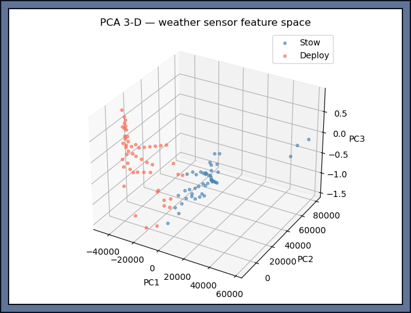
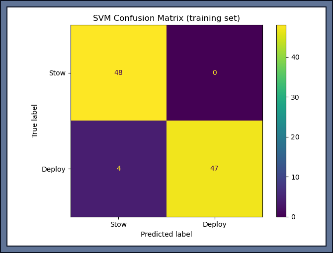
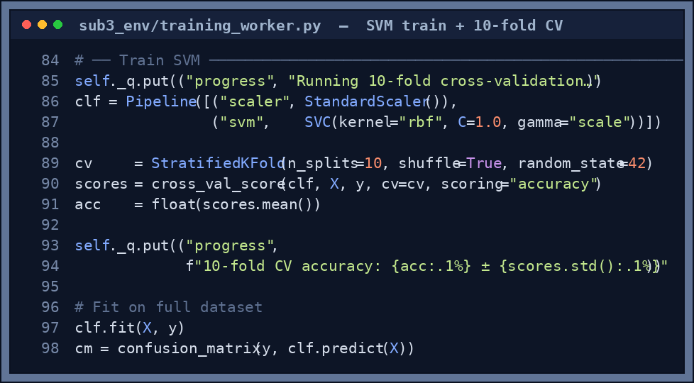

# Sub-3: Environmental Decision

## Responsibility

Read simulated weather sensors once per second and decide whether the umbrella canopy should be `DEPLOY`ed or `STOW`ed. The decision uses a trained SVM classifier that considers current conditions and recent decision history.

---

## How it works

1. Three raw sensor readings are sampled: lux (light level), rain intensity, wind speed
2. Per-reading deltas (change since last reading) are computed for each sensor
3. The last three umbrella decisions are appended as hysteresis features
4. The resulting 9-D feature vector is standardised and passed to the trained SVM
5. A 3-frame hysteresis window prevents rapid flicker — the decision only flips after three consecutive opposing predictions
6. The result (`DEPLOY` or `STOW`) drives the umbrella canopy and is published to `/skyshade/umbrella_cmd`

---

## Feature vector (9-D)

```python
features = [
    lux,            # Current light level (lux)
    rain_raw,       # Raw rain sensor reading [0–1]
    wind_speed,     # Wind speed estimate (m/s)
    lux_delta,      # Change in lux since last reading
    rain_delta,     # Change in rain since last reading
    wind_delta,     # Change in wind since last reading
    prev_action_t1, # Decision at t-1 (1=deploy, 0=stow)
    prev_action_t2, # Decision at t-2
    prev_action_t3, # Decision at t-3
]
```

The `prev_action` features give the model memory — it considers whether the umbrella was recently deployed when making the current decision, naturally implementing hysteresis without hard-coding a rule.

PCA to 3 components is used for visualisation only (`pca_3d.png`) — the SVM trains and infers on the full 9-D space.

<p align="center">
  
</p>

<p align="center"><sub><em><b>Figure 1.</b> The 9-D weather features projected to their first three principal components (visualisation only). The two classes — <b>stow</b> (clear) and <b>deploy</b> (rain) — form well-separated clusters, which is exactly why a simple RBF-SVM reaches 96 % accuracy.</em></sub></p>

---

## Classifier configuration

| Parameter | Value |
|---|---|
| Kernel | RBF |
| C (regularisation) | 1.0 |
| Gamma | `scale` (1 / n_features × X.var()) |
| Cross-validation | 10-fold stratified |
| Target CV accuracy | ≥ 90% |
| Hysteresis window | 3 frames |
| Update rate | 1 Hz |
| Training samples | 99 labelled rows |
| Achieved CV accuracy | **96.0% ± 4.9%** |

---

## Training in the Training Grounds hub

Open the launcher → click **Train SVM** (pink button, Sub-3 card) → Sub-3 Weather tab opens.

Click the pink **Train SVM** button. Training completes in **under 2 seconds**.

Status bar after training:
```
✓ SVM trained — CV accuracy 96.0%  (≥90% target met)
```

A 2×2 confusion matrix appears — green cells (TP/TN) are correct, red cells (FP/FN) are errors. A good model has 0 false positives and ≤ 2 false negatives.

<p align="center">
  
</p>

<p align="center"><sub><em><b>Figure 2.</b> Validation confusion matrix. The strong green diagonal (correct STOW / correct DEPLOY) with <b>zero false-deploys</b> in clear weather is the safety property we care about most — the umbrella never opens when it shouldn't.</em></sub></p>

The SVM itself is a short scikit-learn pipeline (standardise → RBF-SVM) scored with 10-fold cross-validation:

<p align="center">
  
</p>

<p align="center"><sub><em><b>Figure 3.</b> The training core (<code>training_worker.py</code>): a <code>StandardScaler → SVC(rbf)</code> pipeline, 10-fold stratified cross-validation for an honest accuracy estimate, then a final fit on all data plus the confusion matrix.</em></sub></p>

### Live weather demo (no button press needed)

The Sub-3 tab automatically animates a weather cycle every 30 seconds so you can see the SVM making live decisions:

**3D weather scene (left panel, auto-rotates):**

| Element | What it shows |
|---|---|
| **Cloud blob** | Grows larger and darker as rain increases |
| **Blue rain lines** | Falling particles — more lines = heavier rain |
| **Orange wind arrows** | At drone altitude — count increases with wind speed |
| **Quadcopter drone** | At 2.5 m altitude |
| **Green disc + spokes** | Umbrella open — SVM predicted DEPLOY |
| **Grey folded line** | Umbrella closed — SVM predicted STOW |
| **Banner `☂ DEPLOY`** | Green = umbrella is deploying |
| **Banner `✕ STOW`** | Grey = umbrella is stowed |

**Expected behaviour during the cycle:**
```
Clear ☀  → STOW    (high lux, no rain)
Cloudy ⛅ → STOW    (falling lux, slight wind)
Rainy 🌧 → DEPLOY  (low lux, rain > 0.3)
Storm ⛈  → DEPLOY  (very low lux, heavy rain + wind)
```

If the umbrella opens and closes at the correct phase transitions, the SVM is working correctly.

---

## CLI training

```bash
python sub3_env/train_svm.py \
    --data data/env_sensor_log.csv \
    --output models/svm_v1.pkl
```

Outputs: `models/svm_v1.pkl`, `confusion_matrix.png`, `pca_3d.png`

---

## Training data

`data/env_sensor_log.csv` — 99 labelled samples:

```csv
lux,rain_raw,wind_speed,label
85000.0,0.01,1.2,0   ← stow (clear)
40000.0,0.20,3.5,1   ← deploy (light rain)
5000.0,0.90,8.0,1    ← deploy (heavy rain)
```

**Label 0** = stow · **Label 1** = deploy

---

## Integration in the main simulation

The SVM loads at sim start from `models/svm_v1.pkl`. Each second:

```python
cmd = umbrella.predict(lux, rain, wind)   # 0 or 1
umbrella_cmd = "DEPLOY" if cmd else "STOW"
```

The umbrella canopy changes colour in the PyBullet view and the **Umbrella decision** chart in the telemetry dashboard shows live state.

---

## Verification targets

| Metric | Target |
|---|---|
| 10-fold CV accuracy | ≥ 90% |
| False positives (FP) | 0 — never deploy in clear weather |
| False negatives (FN) | ≤ 3 / 99 samples |
| Live demo | Opens in rainy phase, closes in clear phase |

---

## Relevant files

| File | Purpose |
|---|---|
| `sub3_env/train_svm.py` | CLI training script |
| `sub3_env/training_worker.py` | Background thread (used by hub) |
| `sub3_env/feature_engineering.py` | 9-D feature vector builder |
| `sub3_env/classifier.py` | Runtime SVM wrapper with hysteresis |
| `sub3_env/test_env_decision.py` | 5-min weather trajectory validation |
| `data/env_sensor_log.csv` | 99 labelled lux/rain/wind training samples |
| `models/svm_v1.pkl` | Trained SVM pipeline |
| `confusion_matrix.png` | Per-class accuracy on training set |
| `pca_3d.png` | 3-D PCA of the 9-D weather feature space |

---

## Tests

Run the environmental-decision validation test:

```bash
python sub3_env/test_env_decision.py
```

It re-checks cross-validation accuracy and then replays a synthetic 5-minute weather trajectory (clear → cloudy → rainy → clear) to confirm the umbrella doesn't flicker:

| Check | Target | Latest result |
|---|---|---|
| 10-fold CV accuracy | ≥ 90 % | **96.0 %** ✓ |
| Trajectory flip rate (how often the decision flips) | < 10 % | **0.0 %** ✓ |

```text
=== Sub-3 Environmental Decision — Tests ===
10-fold CV accuracy : 0.9600  (target >= 0.9)  ✓
Trajectory flip rate: 0.00%  (target < 10%)  ✓
Sub-3 PASSED
```
