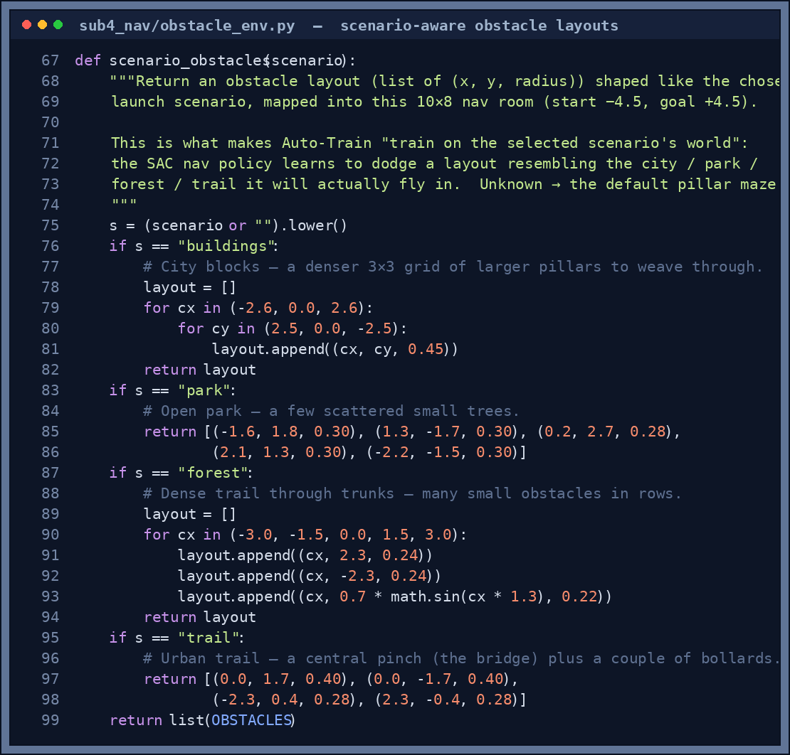

# Sub-4: Navigation and Safety

Sub-4 has two independent policies that run together:

| Policy | Algorithm | Model file | Purpose |
|---|---|---|---|
| **Battery Safety** | MDP value iteration | `models/policy_table_v1.npy` | Override flight when battery / distance is critical |
| **Obstacle Navigation** | **SAC** (off-policy, continuous) | `models/ppo_nav_v1.zip` | Navigate a room with obstacles using 8 lidar rays |

---

## Battery Safety — MDP policy

### Responsibility

Monitor battery level and distance from home. Issue override commands to Sub-2 when continuing normal flight would be unsafe.

### How it works

Every 200 ms the controller:
1. Reads battery percentage and distance from home
2. Discretises both into buckets → state index (0–11)
3. Looks up the pre-computed policy table → action
4. Publishes `CONTINUE`, `RTH`, or `LAND_NOW` to `/skyshade/nav_override`

### State space (12 states)

```
battery_buckets  = [HIGH >75%, MEDIUM 50–75%, LOW 25–50%, CRITICAL <25%]
distance_buckets = [NEAR <20m, MID 20–50m, FAR >50m]
12 total = 4 × 3
```

### Policy table (learned result)

| Battery | NEAR | MID | FAR |
|---|---|---|---|
| HIGH | RTH | RTH | RTH |
| MEDIUM | RTH | RTH | RTH |
| LOW | RTH | RTH | RTH |
| CRITICAL | LAND | LAND | LAND |

### Reward structure

```python
REWARD_SAFE_COMPLETION = +100
REWARD_PER_STEP        =   -1
REWARD_CRASH           = -100
REWARD_BATTERY_EMPTY   = -100
```

### Solver

Value iteration with γ = 0.95, convergence threshold Δ < 1e-6. Converges in ~18 iterations in under 1 ms. The Training Grounds hub shows the convergence curve (max Bellman Δ per iteration) as it solves.

```bash
python sub4_nav/solve_mdp.py --gamma 0.95 --output models/policy_table_v1.npy
```

<p align="center">
  
</p>

<p align="center"><sub><em><b>Figure 1.</b> Battery-safety MDP convergence. The maximum Bellman update Δ drops below the 1e-6 threshold after ~18 sweeps — value iteration has converged and the policy table is stable. The y-axis is log-scaled because Δ shrinks geometrically.</em></sub></p>

---

## Obstacle Navigation — SAC policy

**Algorithm:** Soft Actor-Critic (SAC) — off-policy, sample-efficient reinforcement learning.

SAC was chosen over PPO because:
- **Off-policy replay buffer** — stores all past experience and relearns from it; ~3× fewer env steps to converge
- **Automatic entropy tuning** — no manual curriculum stages needed; the agent self-regulates exploration vs exploitation
- **Continuous action space** — native fit for velocity-setpoint control

### Responsibility

Navigate the drone from the west end of a 10 × 8 m room to the east-side goal zone, dodging 7 cylindrical pillars using 8 lidar (distance) sensors.

### Environment — `ObstacleNavEnv`

File: `sub4_nav/obstacle_env.py`

#### Room layout

The drone flies at a fixed altitude of **1.5 m** inside a 10 m × 8 m × 3.5 m walled room.
Seven red cylindrical pillars (radius 0.3–0.4 m) are placed in two staggered columns across the room.
The drone starts at the west end and must reach a 0.9 m-radius goal zone on the east side.

#### Observation space (12D float32)

| Index | Variable | Description |
|---|---|---|
| 0–7 | `lidar[0..7]` | 8 ray hit fractions ∈ [0, 1]; 0 = obstacle at drone, 1 = open at 5 m range |
| 8–9 | `dx, dy` | Drone − goal vector (m), clipped ±12 |
| 10–11 | `vx, vy` | Drone lateral velocity (m/s), clipped ±5 |

The 8 lidar rays are cast at 45° increments (0°, 45°, 90° … 315°). A hit fraction of 0.4 means an obstacle is 2 m away (40% of 5 m max range).

#### Action space (2D continuous, ±2 m/s)

`[vx_cmd, vy_cmd]` — lateral velocity setpoints converted by the same inner P-controller used in Sub-2.

#### Reward

```python
reward = (prev_dist - dist) × 8.0   # progress toward goal
       - 0.15                         # step penalty
       + 200.0   (on goal arrival)    # completion bonus
       - 50.0    (on obstacle hit)    # collision penalty
       - 30.0    (on wall hit)        # boundary penalty
```

### SAC hyperparameters

```python
SAC("MlpPolicy", env,
    learning_rate   = 3e-4,
    buffer_size     = 100_000,   # off-policy replay memory (all past experience)
    batch_size      = 256,       # larger batches for stable Q-function learning
    tau             = 0.005,     # soft target-network update rate
    gamma           = 0.99,
    ent_coef        = "auto",    # automatic entropy: self-regulating exploration
    learning_starts = 1_000,     # collect this many random steps before first update
    train_freq      = 1,
    gradient_steps  = 1,
    policy_kwargs   = {"net_arch": [256, 256]})
```

**Warm-start fine-tuning:** `learning_rate = 5e-5` (conservative refinement of existing weights).

<p align="center">
  
</p>

<p align="center"><sub><em><b>Figure 2.</b> SAC learning curve when training on the <b>City (Building District)</b> obstacle layout. Mean episode reward climbs from about −176 toward −90 within the first ~12 k steps as the agent stops crashing into pillars and starts making progress toward the goal. A full run (≈150 k steps) carries it well into positive reward.</em></sub></p>

### Scenario-aware training

Auto-Train passes the launcher's **selected scenario** into the nav trainer, so the SAC policy practises on an obstacle layout that *matches the world it will fly in*. `scenario_obstacles()` maps each scenario into the 10 × 8 m nav room:

<p align="center">
  
</p>

<p align="center"><sub><em><b>Figure 3.</b> <code>scenario_obstacles()</code> in <code>obstacle_env.py</code>. The City becomes a dense 3 × 3 grid of pillars to weave through, the Park a few scattered trees, the Forest dense rows of trunks, and the Urban Trail a central pinch (the bridge) plus bollards. An unknown scenario falls back to the default pillar maze.</em></sub></p>

---

## Training from the Training Grounds hub

Open the launcher → click **Solve MDP** → opens the Sub-4 Nav Safety tab.

The 3D room visualisation auto-rotates and shows:
- **Wireframe room** with floor grid, 4 walls, ceiling frame
- **Red cylindrical pillars** with bottom/top circles and vertical surface lines
- **Green goal zone** ring at flight altitude (east end), green star marks the centre
- **Blue arrow** at the start position (west end)
- Once training begins: **live blue drone sphere** + **8 orange lidar rays** fanning out from the drone — the rays shorten as the drone approaches obstacles, showing active sensing
- **Blue position trail** of recent drone XY positions
- **Teal reward curve** on the right showing training progress

Two separate controls:

1. **Train Navigation** (teal) — starts **SAC** obstacle-avoidance training (default 150 k steps, ~3 min; SAC is ~3× more sample-efficient than PPO)
2. **Solve Battery-Safety MDP** (purple) — runs value iteration, completes in under 1 second

### CLI usage

```bash
# Battery safety MDP
python sub4_nav/solve_mdp.py --output models/policy_table_v1.npy

# Obstacle navigation SAC — easiest from the Training Grounds hub
# (Auto-Train trains it on the selected scenario's layout)
```

### Evaluating before launch

Click **Evaluate Model** in the Sub-4 tab. Runs 5 deterministic episodes and:
- Reports per-episode: `✓ GOAL reached`, reward, steps taken
- Draws the best-episode path as a **bright green trail** through the 3D obstacle room
- Reports `PASS ✓ 3/5 episodes reached goal` — pass threshold is ≥3/5 completions

---

## Relevant files

| File | Purpose |
|---|---|
| `sub4_nav/mdp.py` | MDP state/action/reward/transition definitions |
| `sub4_nav/solve_mdp.py` | CLI value-iteration solver |
| `sub4_nav/training_worker.py` | Background MDP solver thread (used by hub) |
| `sub4_nav/policy_table.py` | Runtime battery-safety policy lookup |
| `sub4_nav/obstacle_env.py` | PyBullet 10×8 m obstacle navigation environment |
| `sub4_nav/nav_training_worker.py` | Background **SAC** nav training thread (off-policy, replay buffer) |
| `sub4_nav/eval_worker.py` | 5-episode nav evaluation worker |
| `sub4_nav/test_nav_safety.py` | Battery-safety unit tests |
| `models/policy_table_v1.npy` | Solved MDP battery-safety policy |
| `models/ppo_nav_v1.zip` | Trained **SAC** obstacle navigation model (filename is legacy PPO name) |

---

## Tests

Run the battery-safety validation test:

```bash
python sub4_nav/test_nav_safety.py
```

It runs **50 scripted battery/distance scenarios** and asserts the safety invariants:

| Check | Target | Latest result |
|---|---|---|
| `CONTINUE` never issued while battery is CRITICAL (monotone safety) | all 50 | **50 / 50** ✓ |
| `RTH` fires within one decision tick of a low-battery injection | yes | ✓ |

```text
Results: 50/50 passed
Sub-4 PASSED all 50 scripted scenarios.
```
