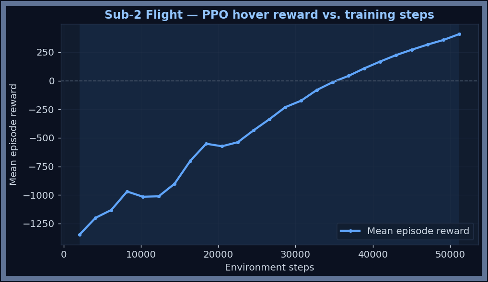
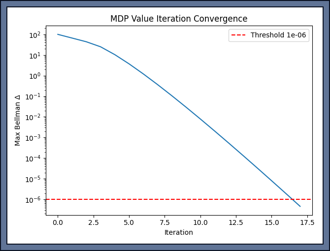
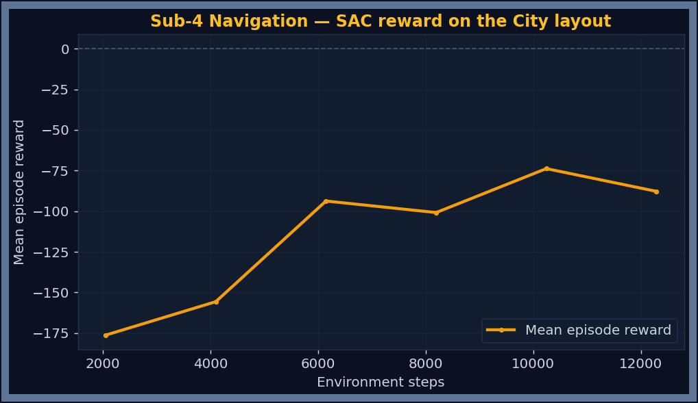

# Validation and Results

This page covers how to verify each subsystem is working — through the Training Grounds hub, the Simulation Complete dialog, and the post-run terminal report.

---

## Post-Run Efficiency Report (terminal)

After every simulation run the terminal prints a colour-coded graded report:

```
════════════════════════════════════════════════════════════
  SkyShade — Post-Run Efficiency Report
════════════════════════════════════════════════════════════
  Sub-2  Hover accuracy   :  73.4%  ✓ good
         Mean hover error  :  0.38 m  ✓ within 0.5m
  Sub-1  Tracker lock     :  98.2%  ✓ reliable
  Sub-3  Umbrella correct :  91.7%  ✓ accurate
  Sub-4  Battery at end   :  42.0%  ✓ safe
════════════════════════════════════════════════════════════
  Overall system score: 87%  Grade: A
════════════════════════════════════════════════════════════
```

### What each metric means

| Metric | What is measured | ✓ Good | ~ OK | ✗ Fix |
|---|---|---|---|---|
| **Hover accuracy** | % of time drone was within 0.5 m of user | ≥ 70% | ≥ 40% | < 40% |
| **Mean hover error** | Average XY distance from user | ≤ 0.5 m | ≤ 1.0 m | > 1.0 m |
| **Tracker lock** | % of frames with confidence ≥ 0.7 | ≥ 80% | ≥ 60% | < 60% |
| **Umbrella correct** | % of time umbrella state matched rain | ≥ 85% | ≥ 65% | < 65% |
| **Battery at end** | Remaining battery at scenario end | ≥ 30% | ≥ 10% | < 10% |

### Overall grade

Overall score = `(hover accuracy + tracker lock + umbrella accuracy) / 3`.

| Grade | Score | Meaning |
|---|---|---|
| A | ≥ 80% | All subsystems performing well |
| B | ≥ 65% | Solid — minor training would help |
| C | ≥ 50% | Some subsystems need more training |
| D | < 50% | One or more critically underperforming |

### If the score is low

| Hint printed | Action |
|---|---|
| `→ Train Sub-2 PPO more` | Click Fine-tune in Sub-2 tab, or tick Sub-2 in the completion dialog |
| `→ Check Sub-1 calibration` | Open Sub-1 Calibrate tab; check HSV bounds and lighting |
| `→ Retrain Sub-3 SVM` | Tick Sub-3 in the completion dialog and click Retrain Selected |

---

## Simulation Complete dialog

The **Simulation Complete** dialog appears after every run instead of the process just exiting. It shows the efficiency report in a GUI with colour-coded verdict chips.

```
 [✓] Sub-2  Hover accuracy    37.2%   ✗ train more   ← auto-ticked (red)
         Mean hover error       0.59 m  ~ close
 [ ] Sub-3  Umbrella correct  91.4%   ✓ accurate
```

Chips:
- **Green** `✓` — threshold met
- **Amber** `~` — acceptable range
- **Red** `✗` — needs attention

Checkboxes auto-tick for any subsystem in the ✗ range. You can adjust manually, then click **Retrain Selected & Run** to open the Training Grounds hub for exactly those subsystems, which closes automatically and relaunches the scenario when done.

---

## Performance trend chart

Every completed run appends a summary entry to `reports/run_metrics_history.json`. The Simulation Complete dialog shows a bar chart of overall% across all past runs with a smoothed trend line:

```
  Performance trend (5 runs)
  70 ██  71 ██  32 ██  40 ██  74 ██
        ╰─────── trend ──────────╯
```

Each bar is coloured by grade (green=A, blue=B, amber=C, red=D). The most recent run has a white outline. If overall scores are rising, training is working.

---

## Live graph overlays (Drone POV window)

The **Drone POV & AI Evidence** window shows 5 real-time graphs during the simulation:

| Graph | What to look for |
|---|---|
| **Sub-1 Marker tracking confidence** | Should stay near 1.0; dips mean occlusion |
| **Sub-2 Hover error (m)** | Should stay below 0.5 m; spikes when user moves fast |
| **Sub-2 Tree avoidance force (N)** | Spikes near tree trunks or crowd pedestrians |
| **Sub-4 Battery (%)** | Steady linear decline |
| **Sub-3 Umbrella decision** | Steps between 0 (stow) and 1 (deploy) |

**Ghost lines** (dashed, faded, colour-coded) show the same signal from the last 5 runs. If the bright current line tracks the same shape as the ghost lines, the system is consistent. If it's lower/better, training improved it.

---

## Automated test suite

Beyond the live GUI checks, each subsystem has a scripted validation test that prints a PASS/FAIL summary:

```bash
python sub1_perception/test_perception.py
python sub2_flight/test_flight.py
python sub3_env/test_env_decision.py
python sub4_nav/test_nav_safety.py
```

| Subsystem | Check | Target | Latest result |
|---|---|---|---|
| Sub-1 Perception | continuity / position MAE | > 70 % / < 0.15 m | **100 % / 0.081 m** ✓ |
| Sub-2 Flight | mean reward / hover successes | > 150 / ≥ 9 of 10 | **+2666…+2705 / 10 of 10** ✓ |
| Sub-3 Weather | 10-fold CV / flip rate | ≥ 90 % / < 10 % | **96.0 % / 0.0 %** ✓ |
| Sub-4 Nav Safety | scripted safety scenarios | 50 of 50 | **50 of 50** ✓ |

---

## Per-subsystem validation

### Sub-1 Perception

Open the **Sub-1 Calibrate** tab in the Training Grounds hub.

**Pass:** Detected centroid within 18 px of true centre, confidence ≥ 0.7.  
**Live display:** White circle = expected centre, green box = detected, confidence bar.

### Sub-2 Flight Control

Open the **Sub-2 Flight PPO** tab.

After training, click **Evaluate Model** — this runs 5 test episodes and draws the best path as a green trail in the 3D arena.

**Pass:** Hover accuracy ≥ 40% in the live sim (aim for ≥ 70% with full 1.5 M step training).

> **Note:** The PPO model must be trained with `LINEAR_DAMPING = 2.5` (the default). Changing this parameter after training invalidates the model and causes ~3% hover accuracy. Retrain from scratch if damping is changed.

<p align="center">
  
</p>

<p align="center"><sub><em><b>Figure 1.</b> Sub-2 PPO training reward (logged via TensorBoard) climbing from ≈ −1350 to +408 across the three wind/curriculum stages.</em></sub></p>

### Sub-3 Weather / SVM

Open the **Sub-3 Weather** tab.

After training, the confusion matrix and CV accuracy are shown. ≥ 85% CV accuracy means the SVM is classifying sensor readings correctly.

<p align="center">
  
</p>

<p align="center"><sub><em><b>Figure 2.</b> Sub-3 SVM confusion matrix — a strong correct-prediction diagonal with zero false-deploys (the umbrella never opens in clear weather). 10-fold CV accuracy 96.0 %.</em></sub></p>

### Sub-4 Navigation / Safety

Open the **Sub-4 Safety** tab.

**MDP:** The convergence curve should flatten below 1×10⁻⁶ delta. The policy heatmap shows CONTINUE (green) in safe states, RTH (yellow) near low-battery, LAND_NOW (red) at critical.

<p align="center">
  
  &nbsp;&nbsp;
  
</p>

<p align="center"><sub><em><b>Figure 3.</b> Left — the battery-safety MDP converges (max Bellman Δ below 1e-6) in ~18 value-iteration sweeps. Right — the SAC nav agent's reward rising on the City obstacle layout.</em></sub></p>

**Nav SAC:** Click **Evaluate Navigation** — the drone attempts 5 obstacle-room episodes and draws the path. Look for paths that reach the goal marker without touching obstacles.

---

## Run history files

| File | Contents | Max entries |
|---|---|---|
| `reports/run_summary_latest.json` | Full stats for the most recent run | 1 (overwritten) |
| `reports/run_metrics_history.json` | Summary + 1-Hz time-series for each run | 20 (oldest dropped) |
| `reports/training_history.json` | PPO reward curves and Nav SAC data | 10 training sessions each |

These files are written automatically. Delete them to reset the history charts to a clean state.
